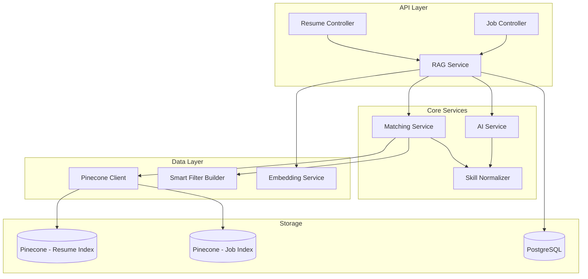
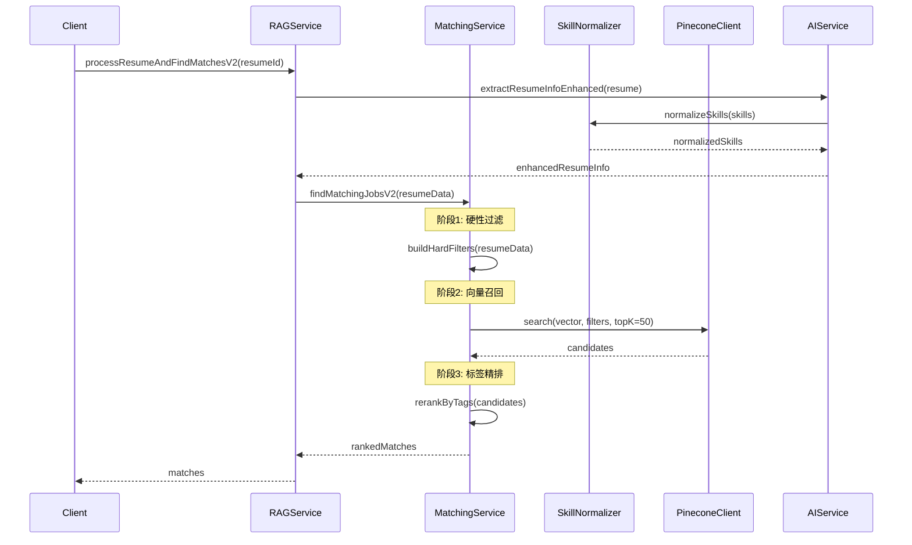

# Design Document: 简历与岗位匹配度优化

## Overview

本设计文档描述了 BlockRecruit 平台简历与岗位匹配度优化功能的技术实现方案。核心目标是通过技能标准化、统一标签结构、优化 Embedding 文本格式、以及实现硬性过滤+向量召回+标签精排的匹配流程来提升匹配准确度。

### 设计目标

1. **提升匹配准确度**: 通过技能标准化消除同义词差异，通过统一标签结构确保一致的过滤和匹配
2. **提高向量质量**: 优化 Embedding 文本格式，减少描述性内容对向量的稀释
3. **增强匹配效率**: 实现硬性过滤+向量召回+标签精排的三阶段匹配流程
4. **保持向后兼容**: 新增 V2 方法，不影响现有 API

### 技术栈

- **后端**: Node.js + Koa + TypeScript
- **数据库**: PostgreSQL (Prisma)
- **向量数据库**: Pinecone
- **AI**: OpenRouter (LLM) + BAAI/bge-m3 (Embedding)

## Architecture

### 系统架构图



### 匹配流程时序图



## Components and Interfaces

### 1. Skill Normalizer (新增)

**文件位置**: `apps/api/src/services/rag/skillNormalizer.ts`

```typescript
/**
 * 技能分类枚举
 */
export enum SkillCategory {
  PROGRAMMING_LANGUAGE = 'programming_language',
  BLOCKCHAIN = 'blockchain',
  FRONTEND = 'frontend',
  BACKEND = 'backend',
  DATABASE = 'database',
  CLOUD = 'cloud',
  DEVOPS = 'devops',
  PRODUCT = 'product',
  OPERATION = 'operation',
  MARKETING = 'marketing',
  DESIGN = 'design',
  RESEARCH = 'research',
  OTHER = 'other'
}

/**
 * 标准化技能结果
 */
export interface NormalizedSkill {
  original: string;           // 原始技能名称
  normalized: string;         // 标准化后的名称
  category: SkillCategory;    // 技能分类
  aliases: string[];          // 同义词列表
}

/**
 * 技能标准化服务接口
 */
export interface ISkillNormalizer {
  /**
   * 标准化单个技能
   */
  normalize(skill: string): NormalizedSkill;
  
  /**
   * 批量标准化技能
   */
  normalizeMany(skills: string[]): NormalizedSkill[];
  
  /**
   * 获取技能分类
   */
  getCategory(skill: string): SkillCategory;
  
  /**
   * 检查两个技能是否等价
   */
  areEquivalent(skill1: string, skill2: string): boolean;
  
  /**
   * 获取技能的所有同义词
   */
  getAliases(skill: string): string[];
}
```

### 2. Unified Types (新增)

**文件位置**: `apps/api/src/services/rag/types.ts` (扩展)

```typescript
/**
 * 岗位类型枚举
 */
export enum JobType {
  TECHNICAL = 'technical',
  PRODUCT = 'product',
  OPERATION = 'operation',
  MARKETING = 'marketing',
  DESIGN = 'design',
  RESEARCH = 'research',
  OTHER = 'other'
}

/**
 * 统一标签结构 - 简历和岗位共用
 */
export interface UnifiedTags {
  normalizedSkills: string[];           // 标准化后的技能列表
  skillCategories: SkillCategory[];     // 技能分类列表
  experienceYears: number;              // 经验年限
  educationLevel: string;               // 学历
  jobType: JobType;                     // 岗位类型
  location: string;                     // 地点
  industry: string[];                   // 行业
}

/**
 * 统一的 Pinecone Metadata 结构
 * 简历和岗位使用相同的字段名
 */
export interface UnifiedMetadata {
  id: string;                           // 实体ID
  type: 'resume' | 'job';               // 类型标识
  normalized_skills: string[];          // 标准化技能（统一字段名）
  skill_categories: string[];           // 技能分类
  experience_years: number;             // 经验年限
  education_level: string;              // 学历
  job_type: string;                     // 岗位类型
  location: string;                     // 地点
  industry: string[];                   // 行业
  update_time: string;                  // 更新时间
  
  // 简历特有字段
  owner?: string;                       // 简历所有者ID
  expected_salary_min?: number;         // 期望薪资下限
  expected_salary_max?: number;         // 期望薪资上限
  
  // 岗位特有字段
  company?: string;                     // 公司名称
  title?: string;                       // 岗位标题
  required_skills?: string[];           // 必须技能（原始）
  preferred_skills?: string[];          // 加分技能（原始）
  salary_min?: number;                  // 薪资下限
  salary_max?: number;                  // 薪资上限
  job_level?: string;                   // 岗位级别
}
```

### 3. Matching Service (新增)

**文件位置**: `apps/api/src/services/rag/matchingService.ts`

```typescript
/**
 * 匹配配置
 */
export interface MatchingConfig {
  hardFilterEnabled: boolean;           // 是否启用硬性过滤
  vectorRecallTopK: number;             // 向量召回数量
  finalTopK: number;                    // 最终返回数量
  minVectorScore: number;               // 最低向量相似度
  relaxFilterOnEmpty: boolean;          // 空结果时是否放宽过滤
  weights: {
    skillMatch: number;                 // 技能匹配权重
    vectorSimilarity: number;           // 向量相似度权重
    experienceMatch: number;            // 经验匹配权重
    salaryMatch: number;                // 薪资匹配权重
  };
}

/**
 * 匹配结果
 */
export interface MatchingResult {
  id: string;
  score: number;                        // 综合得分
  vectorScore: number;                  // 向量相似度
  skillMatchScore: number;              // 技能匹配度
  experienceMatchScore: number;         // 经验匹配度
  salaryMatchScore: number;             // 薪资匹配度
  matchedSkills: string[];              // 匹配的技能
  missingSkills: string[];              // 缺失的技能
  metadata: UnifiedMetadata;
}

/**
 * 匹配服务接口
 */
export interface IMatchingService {
  /**
   * 为简历查找匹配的岗位
   */
  findMatchingJobsForResume(
    resumeData: UnifiedTags,
    resumeVector: number[],
    config?: Partial<MatchingConfig>
  ): Promise<MatchingResult[]>;
  
  /**
   * 为岗位查找匹配的简历
   */
  findMatchingResumesForJob(
    jobData: UnifiedTags & { requiredSkills: string[] },
    jobVector: number[],
    config?: Partial<MatchingConfig>
  ): Promise<MatchingResult[]>;
  
  /**
   * 构建硬性过滤条件
   */
  buildHardFilters(
    sourceData: UnifiedTags,
    targetType: 'resume' | 'job'
  ): Record<string, unknown>;
  
  /**
   * 执行标签精排
   */
  rerankByTags(
    candidates: Array<{ id: string; score: number; metadata: UnifiedMetadata }>,
    sourceData: UnifiedTags,
    config: MatchingConfig
  ): MatchingResult[];
}
```

### 4. AI Service 扩展

**文件位置**: `apps/api/src/services/ai/aiService.ts` (扩展)

```typescript
/**
 * 增强的简历结构化信息
 */
export interface EnhancedResumeInfo extends ResumeStructuredInfo {
  normalizedSkills: NormalizedSkill[];  // 标准化后的技能
  skillCategories: SkillCategory[];     // 技能分类
  targetJobType: JobType;               // 目标岗位类型
}

/**
 * 增强的岗位结构化信息
 */
export interface EnhancedJobInfo extends JobStructuredInfo {
  normalizedRequiredSkills: NormalizedSkill[];   // 标准化必须技能
  normalizedPreferredSkills: NormalizedSkill[];  // 标准化加分技能
  skillCategories: SkillCategory[];              // 技能分类
  jobType: JobType;                              // 岗位类型
}

/**
 * AI 服务扩展接口
 */
export interface IAIServiceEnhanced extends AIService {
  /**
   * 增强版简历信息提取
   */
  extractResumeInfoEnhanced(resume: Resume): Promise<EnhancedResumeInfo>;
  
  /**
   * 增强版岗位信息提取
   */
  extractJobInfoEnhanced(job: Job): Promise<EnhancedJobInfo>;
}
```

### 5. RAG Service 扩展

**文件位置**: `apps/api/src/services/rag/ragService.ts` (扩展)

```typescript
/**
 * RAG 服务扩展方法
 */
export interface IRAGServiceV2 {
  /**
   * V2 版本：处理简历并查找匹配岗位
   * 使用新的匹配流程
   */
  processResumeAndFindMatchesV2(resumeId: string): Promise<{
    resumeData: Resume;
    matches: MatchingResult[];
    rawJobsData: Record<string, unknown>[];
  }>;
  
  /**
   * V2 版本：处理岗位
   * 使用新的标签提取和向量化流程
   */
  processJobV2(job: Job): Promise<{
    vectorId: string;
    vectorizeSuccess: boolean;
    metadata: UnifiedMetadata;
  }>;
  
  /**
   * V2 版本：格式化简历用于 Embedding
   * 技能优先，减少描述性内容
   */
  formatResumeForEmbeddingV2(
    resume: Resume,
    enhancedInfo: EnhancedResumeInfo
  ): string;
  
  /**
   * V2 版本：格式化岗位用于 Embedding
   * 必须技能优先
   */
  formatJobForEmbeddingV2(
    job: Job,
    enhancedInfo: EnhancedJobInfo
  ): string;
}
```

## Data Models

### 技能同义词映射表

```typescript
/**
 * 技能同义词映射
 * key: 标准名称
 * value: 同义词列表
 */
const SKILL_SYNONYMS: Record<string, string[]> = {
  // 编程语言
  'JavaScript': ['JS', 'ECMAScript', 'ES6', 'ES2015'],
  'TypeScript': ['TS'],
  'Python': ['Python3', 'Py'],
  'Rust': ['Rust Lang'],
  'Go': ['Golang', 'Go Lang'],
  'Solidity': ['Sol'],
  
  // 前端框架
  'React': ['ReactJS', 'React.js', 'React JS'],
  'Vue': ['Vue.js', 'VueJS', 'Vue JS', 'Vue3', 'Vue 3'],
  'Angular': ['AngularJS', 'Angular.js'],
  'Next.js': ['NextJS', 'Next'],
  
  // 后端框架
  'Node.js': ['NodeJS', 'Node'],
  'Express': ['Express.js', 'ExpressJS'],
  'Koa': ['Koa.js', 'KoaJS'],
  'NestJS': ['Nest.js', 'Nest'],
  
  // 区块链
  'Ethereum': ['ETH', '以太坊'],
  'Smart Contract': ['智能合约', 'Smart Contracts'],
  'DeFi': ['去中心化金融', 'Decentralized Finance'],
  'NFT': ['Non-Fungible Token', '非同质化代币'],
  'DAO': ['去中心化自治组织', 'Decentralized Autonomous Organization'],
  'Web3': ['Web 3.0', 'Web3.0'],
  
  // 数据库
  'PostgreSQL': ['Postgres', 'PG'],
  'MongoDB': ['Mongo'],
  'Redis': ['Redis Cache'],
  'MySQL': ['MariaDB'],
  
  // 云服务
  'AWS': ['Amazon Web Services', '亚马逊云'],
  'Azure': ['Microsoft Azure', '微软云'],
  'GCP': ['Google Cloud Platform', '谷歌云'],
  
  // DevOps
  'Docker': ['容器化', 'Containerization'],
  'Kubernetes': ['K8s', 'K8S', '容器编排'],
  'CI/CD': ['持续集成', '持续部署', 'Continuous Integration'],
  
  // 产品
  'Product Management': ['产品管理', 'PM', '产品经理'],
  'User Research': ['用户研究', '用研'],
  'PRD': ['产品需求文档', 'Product Requirements Document'],
  
  // 运营
  'Community Operation': ['社区运营', '社群运营'],
  'Growth Hacking': ['增长黑客', '用户增长'],
  'Content Operation': ['内容运营'],
  
  // 市场
  'Marketing': ['市场营销', '营销'],
  'Brand Marketing': ['品牌营销'],
  'Digital Marketing': ['数字营销', '数字化营销'],
  
  // 设计
  'UI Design': ['UI设计', '界面设计'],
  'UX Design': ['UX设计', '用户体验设计'],
  'Figma': ['Figma Design'],
  'Sketch': ['Sketch App'],
};

/**
 * 技能分类映射
 */
const SKILL_CATEGORIES: Record<SkillCategory, string[]> = {
  [SkillCategory.PROGRAMMING_LANGUAGE]: [
    'JavaScript', 'TypeScript', 'Python', 'Rust', 'Go', 'Solidity', 
    'Java', 'C++', 'C#', 'Ruby', 'PHP', 'Swift', 'Kotlin'
  ],
  [SkillCategory.BLOCKCHAIN]: [
    'Ethereum', 'Smart Contract', 'DeFi', 'NFT', 'DAO', 'Web3',
    'Solana', 'Polygon', 'Avalanche', 'Cosmos', 'Polkadot',
    'Token Economics', 'Tokenomics', 'Hardhat', 'Foundry', 'Truffle'
  ],
  [SkillCategory.FRONTEND]: [
    'React', 'Vue', 'Angular', 'Next.js', 'Nuxt.js', 'Svelte',
    'HTML', 'CSS', 'SASS', 'TailwindCSS', 'Webpack', 'Vite'
  ],
  [SkillCategory.BACKEND]: [
    'Node.js', 'Express', 'Koa', 'NestJS', 'Django', 'Flask',
    'Spring Boot', 'FastAPI', 'GraphQL', 'REST API'
  ],
  [SkillCategory.DATABASE]: [
    'PostgreSQL', 'MongoDB', 'Redis', 'MySQL', 'Elasticsearch',
    'DynamoDB', 'Cassandra', 'Neo4j'
  ],
  [SkillCategory.CLOUD]: [
    'AWS', 'Azure', 'GCP', 'Vercel', 'Netlify', 'Cloudflare'
  ],
  [SkillCategory.DEVOPS]: [
    'Docker', 'Kubernetes', 'CI/CD', 'Jenkins', 'GitHub Actions',
    'Terraform', 'Ansible', 'Linux'
  ],
  [SkillCategory.PRODUCT]: [
    'Product Management', 'User Research', 'PRD', 'Agile', 'Scrum',
    'JIRA', 'Roadmap', 'A/B Testing'
  ],
  [SkillCategory.OPERATION]: [
    'Community Operation', 'Growth Hacking', 'Content Operation',
    'User Operation', 'Data Analysis', 'KOL Management'
  ],
  [SkillCategory.MARKETING]: [
    'Marketing', 'Brand Marketing', 'Digital Marketing', 'SEO', 'SEM',
    'Social Media Marketing', 'Content Marketing'
  ],
  [SkillCategory.DESIGN]: [
    'UI Design', 'UX Design', 'Figma', 'Sketch', 'Adobe XD',
    'Photoshop', 'Illustrator', 'Motion Design'
  ],
  [SkillCategory.RESEARCH]: [
    'Market Research', 'Competitive Analysis', 'Data Science',
    'Machine Learning', 'Quantitative Analysis'
  ],
  [SkillCategory.OTHER]: []
};
```

### 默认匹配配置

```typescript
const DEFAULT_MATCHING_CONFIG: MatchingConfig = {
  hardFilterEnabled: true,
  vectorRecallTopK: 50,
  finalTopK: 10,
  minVectorScore: 0.6,
  relaxFilterOnEmpty: true,
  weights: {
    skillMatch: 0.4,
    vectorSimilarity: 0.25,
    experienceMatch: 0.2,
    salaryMatch: 0.15
  }
};
```


## Correctness Properties

*A property is a characteristic or behavior that should hold true across all valid executions of a system—essentially, a formal statement about what the system should do. Properties serve as the bridge between human-readable specifications and machine-verifiable correctness guarantees.*

### Property 1: 技能同义词等价性

*For any* 两个属于同一同义词组的技能名称，调用 Skill_Normalizer.normalize() 后应该返回相同的标准化名称。

**Validates: Requirements 1.2, 1.5, 1.6**

### Property 2: 技能分类一致性

*For any* 已知技能名称，调用 Skill_Normalizer.getCategory() 应该返回一个有效的 SkillCategory 枚举值，且同一技能多次调用返回相同的分类。

**Validates: Requirements 1.1, 1.7**

### Property 3: Metadata 格式一致性

*For any* 简历或岗位，通过 RAG_Service 存储到 Pinecone 后，其 metadata 应该包含 UnifiedMetadata 定义的所有必需字段，且 normalized_skills 字段为非空数组。

**Validates: Requirements 2.3, 2.4, 2.5**

### Property 4: AI 提取技能标准化

*For any* 简历或岗位，通过 AI_Service 提取的技能列表中的每个技能都应该是标准化后的格式，即调用 Skill_Normalizer.normalize(skill).normalized 应该等于 skill 本身。

**Validates: Requirements 3.1, 3.2, 3.3**

### Property 5: Embedding 文本技能优先

*For any* 简历或岗位，格式化后的 Embedding 文本中，技能相关内容（包含 "技能" 或 "skills" 关键词的行）应该出现在文本的前 20% 位置内。

**Validates: Requirements 4.1, 4.2**

### Property 6: Embedding 文本长度限制

*For any* 简历或岗位内容（无论原始长度多长），格式化后的 Embedding 文本长度应该 <= 4000 字符。

**Validates: Requirements 4.3, 4.5**

### Property 7: 硬性过滤经验条件

*For any* 求职者和过滤后的岗位列表，列表中每个岗位的经验年限要求都应该 <= 求职者的经验年限。

**Validates: Requirements 5.2**

### Property 8: 硬性过滤技能条件

*For any* 求职者和过滤后的岗位列表（在严格模式下），列表中每个岗位的必须技能都应该是求职者技能的子集。

**Validates: Requirements 5.3**

### Property 9: 精排分数有效范围

*For any* 匹配结果，其 skillMatchScore、experienceMatchScore、salaryMatchScore 都应该在 [0, 1] 范围内。

**Validates: Requirements 5.6, 5.7, 5.8**

### Property 10: 精排加权公式正确性

*For any* 匹配结果，其最终 score 应该等于 skillMatchScore * 0.4 + vectorScore * 0.25 + experienceMatchScore * 0.2 + salaryMatchScore * 0.15（允许浮点误差 0.001）。

**Validates: Requirements 5.9**

### Property 11: 过滤放宽有效性

*For any* 查询条件，如果严格过滤返回空结果，则放宽过滤后返回的结果数量应该 >= 0（即不会抛出错误），且如果存在符合放宽条件的数据，结果数量应该 > 0。

**Validates: Requirements 5.10**

### Property 12: 向后兼容性

*For any* 简历 ID，调用 processResumeAndFindMatches（旧方法）返回的结果结构应该与升级前保持一致，包含 resumeData、matches、rawJobsData 字段。

**Validates: Requirements 6.3**

## Error Handling

### 1. 技能标准化错误处理

| 错误场景 | 处理策略 |
|---------|---------|
| 未知技能名称 | 返回原始名称作为标准化名称，分类设为 OTHER |
| 空字符串输入 | 返回空字符串，分类设为 OTHER |
| 特殊字符输入 | 清理特殊字符后再进行标准化 |

### 2. AI 提取错误处理

| 错误场景 | 处理策略 |
|---------|---------|
| LLM 调用超时 | 重试 2 次，每次间隔 1 秒 |
| LLM 返回格式错误 | 使用默认值填充缺失字段 |
| 简历/岗位内容为空 | 返回空的结构化数据，不抛出错误 |

### 3. 匹配服务错误处理

| 错误场景 | 处理策略 |
|---------|---------|
| Pinecone 连接失败 | 重试 3 次，记录错误日志 |
| 向量维度不匹配 | 抛出明确的错误信息 |
| 硬性过滤无结果 | 自动放宽条件重试 |
| 放宽后仍无结果 | 返回空数组，不抛出错误 |

### 4. 向量存储错误处理

| 错误场景 | 处理策略 |
|---------|---------|
| Embedding 生成失败 | 重试 2 次，失败后记录错误 |
| Pinecone upsert 失败 | 重试 3 次，返回失败状态 |
| Metadata 格式错误 | 验证并修正格式后重试 |

## Testing Strategy

### 单元测试

单元测试用于验证具体示例和边界情况：

1. **Skill Normalizer 测试**
   - 测试已知同义词的映射（如 "ReactJS" -> "React"）
   - 测试中文技能名称映射（如 "智能合约" -> "Smart Contract"）
   - 测试未知技能的处理
   - 测试空输入和特殊字符输入

2. **Matching Service 测试**
   - 测试硬性过滤的边界情况（经验年限为 0、技能为空）
   - 测试精排分数计算的边界值
   - 测试过滤放宽的触发条件

3. **RAG Service V2 测试**
   - 测试 Embedding 文本格式化的具体输出
   - 测试 Metadata 结构的完整性
   - 测试向后兼容性

### 属性测试

属性测试用于验证普遍性质，使用 fast-check 库：

**配置要求**：
- 每个属性测试运行至少 100 次迭代
- 使用 `fc.assert` 进行断言
- 每个测试标注对应的设计文档属性编号

**测试标签格式**：
```typescript
// Feature: resume-job-matching-optimization, Property 1: 技能同义词等价性
```

### 集成测试

1. **端到端匹配流程测试**
   - 测试完整的 processResumeAndFindMatchesV2 流程
   - 验证从简历上传到匹配结果的完整链路

2. **Pinecone 集成测试**
   - 测试向量存储和检索的一致性
   - 测试过滤条件的正确应用

### 测试覆盖目标

| 模块 | 单元测试覆盖率 | 属性测试覆盖 |
|-----|--------------|-------------|
| skillNormalizer.ts | >= 90% | Property 1, 2 |
| matchingService.ts | >= 85% | Property 7, 8, 9, 10, 11 |
| ragService.ts (V2 方法) | >= 80% | Property 3, 4, 5, 6, 12 |
| aiService.ts (增强方法) | >= 75% | Property 4 |
